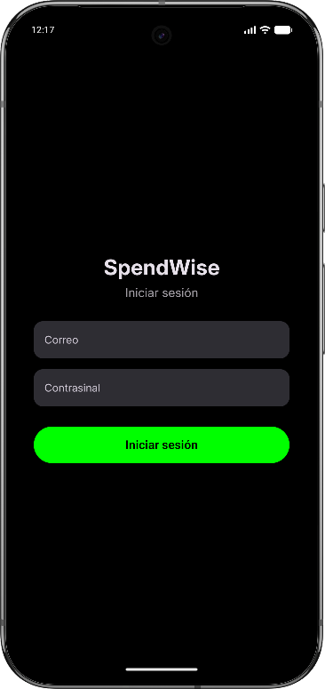
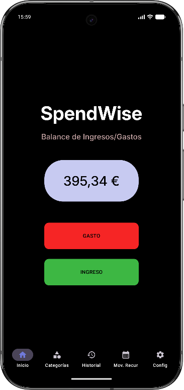
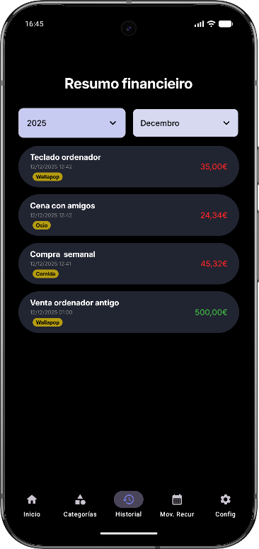
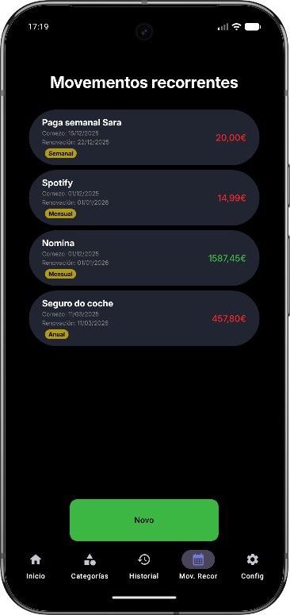

# DEFENSA PROXECTO SPENDWISE

# 📱 SpendWise

## 🧾 ¿Qué es SpendWise?
**SpendWise** é unha aplicación móbil Android deseñada para o **control e xestión de finanzas persoais**.  
Permite ó usuario rexistrar, organizar e analizar os seus **ingresos e gastos** de forma clara, sinxela e eficiente.

O obxetivo final é axudar a tomar **mellores decisións económicas**, ofrecendo unha visión real do estado financiero do usuario.

---

## 🎯 Funcionalidades principais
- ➕ Rexistro de **ingresos e gastos**
- 🗂️ Clasificación mediante **categorías persoalizadas**
- 🔁 Soporte para **movementos recorrentes**
- 📊 Visualización do balance e evolución do gasto. Histórico completo filtrado por mes e ano
- 🔔 **Notificacións** automáticas para renovacións programadas
- 🔐 **Autenticación** de usuario a través do dispositivo e dun correo e contrasinal
- ⟳ **Sincronización** remota de datos

  
  
  
  
  

---

## 🏗️ Arquitectura y tecnoloxías
SpendWise está desenvolta seguindo boas prácticas e unha arquitectura moderna:

- **Jetpack Compose** → Construcción da interfaz de usuario declarativa
- **Room** → Persistencia local de datos mediante SQLite
- **Flow** → Manexo de datos reactivos e observables
- **ViewModel** → Xestión do estado e lóxica de negocio
- **Navigation Compose** → Navegación entre pantallas
- **WorkManager** → Procesos en segundo plano (tareas periódicas)
- **Retrofit** → Comunicación coa API backend PocketBase

  
  
  
  

---

## 💡 Enfoque do proxecto
SpendWise prioriza:
- Simplicidade de uso
- Código limpo e mantible
- Separación de responsabilidades en capas e encapsulación de procesos
- Escalabilidade e posibilidade de futuras ampliacións

---

## 🚀 Obxetivo final
Proporcionar unha ferramenta fiable e cómoda que permita ao usuario **entender, controlar e mellorar a súa economía persoal** dende o seu dispositivo móbil permitindo aforrar e ser consciente dos gastos e ingresos, e a donde se destinan.