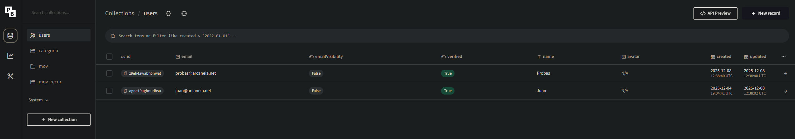
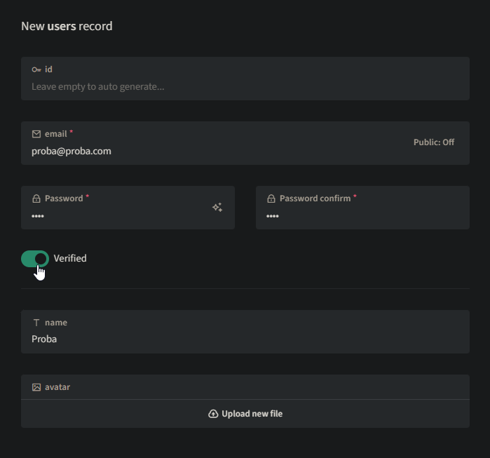
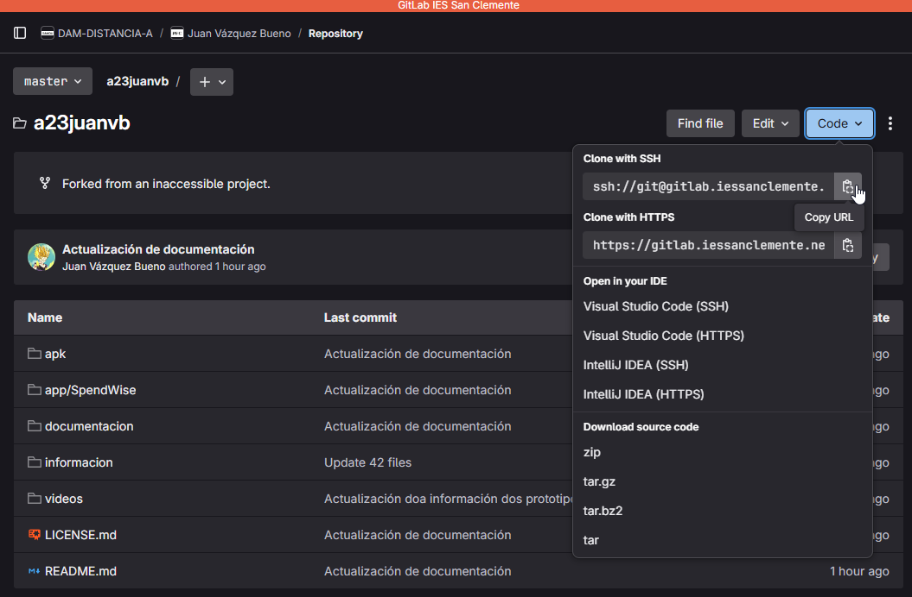
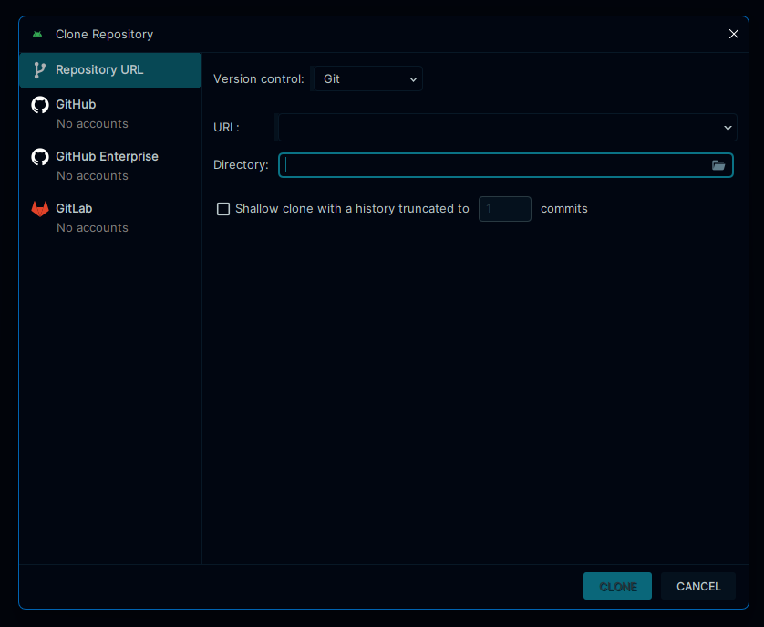
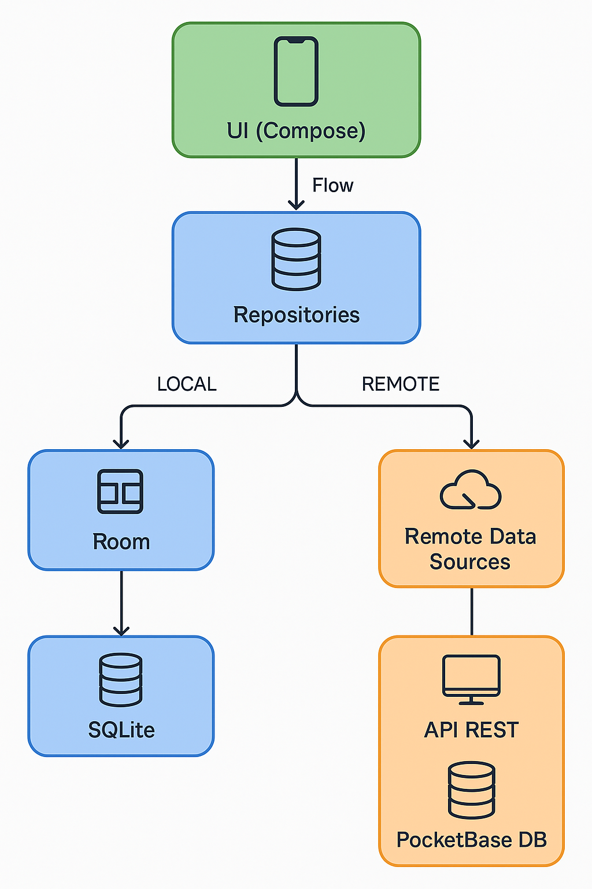
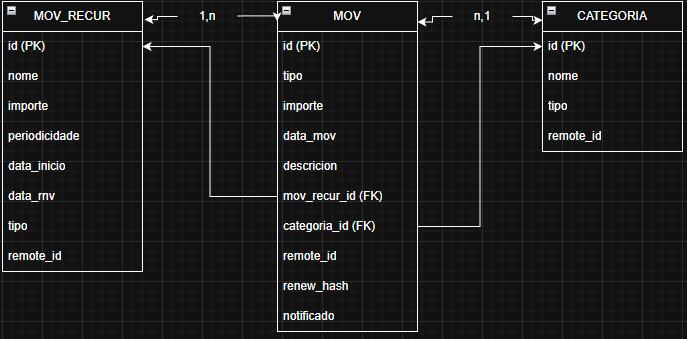

# Manual técnico SpendWise 2025

- [Manual técnico SpendWise 2025](#manual-técnico-spendwise-2025)
  - [Introdución](#introdución)
  - [Despregue PocketBase utilizando Docker](#despregue-pocketbase-utilizando-docker)
  - [Clonado repositorio](#clonado-repositorio)
  - [Estrutura do código](#estrutura-do-código)
  - [Documentación da aplicación](#documentación-da-aplicación)
  - [Datos](#datos)
  - [Tecnoloxías empregadas](#tecnoloxías-empregadas)
  - [Despregue](#despregue)

## Introdución
SpendWise é unha aplicación desenvolta en Android Studio utilizando Jetpack Compose, SQLite, ROOM, FLOW e facendo un gardado de datos e login contra unha base de datos PocketBase. A continuación expoñerase como poder crear este entorno de desenvolvemento.

## Despregue PocketBase utilizando Docker
PocketBase permite ser autoaloxada nun servidor local, o seu repositorio en GitHub é o seguinte: [PocketBase](https://github.com/pocketbase/pocketbase) e tamén dispón dunha páxina web: [Web PocketBase](https://pocketbase.io/).
Esta aplicación está baseada en coleccións polo que ten múltiples usos. Dispón dunha API para os despregues de escritorio, no caso de SpendWise ao ser unha aplicación android ainda non dispón dunha API propia soportada, pero sí soporta API REST que será o método que utilicemos para crear e consultar datos.
A continuación exponse a configuración utilizada para o desenvolvemento do proxecto SpendWise:

- A base de datos pocketbase está despregada nun contenedor docker nun servidor Linux virtualizado con Proxmox.
- Ó contenedor accedese a través dun proxy configurado para bloquear o acceso a /_/ donde está a administración do servicio. Tamén fai unha redirección ao porto 8090 utilizado para a API e engade un certificado HTTPS xerado con Let's Encrypt. Tanto Nginx como PocketBase atopanse nunha rede DMZ securizada e ambos están no mesmo servidor docker compartido unha rede docker O dominio utilizado é valora.arcaneia.net, un subdominio de arcaneia.net, propiedade do autor da aplicación. A continuación mostrase a configuración usada:

  - Docker Compose PocketBase: [Doc](https://github.com/muchobien/pocketbase-docker)

```yaml
services:
  pocketbase:
    image: ghcr.io/muchobien/pocketbase:latest
    container_name: pocketbase
    restart: unless-stopped
    networks:
      - proxy_net

    environment:
      PB_HOST: 0.0.0.0
      PB_PORT: 8090
      PB_ADMIN_EMAIL: ${ADMIN_EMAIL}
      PB_ADMIN_PASSWORD: ${ADMIN_PASSWORD}
      ENCRYPTION: ${PB_ENCRYPTION_KEY}
      TZ: Europe/Madrid

    ports:
      - "8090:8090"

    volumes:
      - ./pb_data:/pb_data
      - ./pb_public:/pb_public
      - ./pb_hooks:/pb_hooks
      - ./pb_logs:/pb_data/logs

    command: ["--encryptionEnv", "ENCRYPTION"]
    healthcheck:
      test:
        [
          "CMD",
          "wget",
          "--no-verbose",
          "--tries=1",
          "--spider",
          "http://localhost:8090/api/health",
        ]
      interval: 30s
      timeout: 10s
      retries: 3
      start_period: 30s

    user: "1000:1000"

networks:
  proxy_net:
    external:
      name: nginxproxy_proxy_net
```
- (Opcional) Nginx Proxy Manager: [Doc](https://nginxproxymanager.com/setup/)
```yaml
services:
  npm:
    image: jc21/nginx-proxy-manager:latest
    container_name: nginx-proxy-manager
    restart: unless-stopped

    ports:
      - "80:80"
      - "443:443"
      - "172.16.66.10:81:81"

    networks:
      - proxy_net

    environment:
      DISABLE_IPV6: 'true'

    volumes:
      - ./data:/data
      - ./letsencrypt:/etc/letsencrypt

    deploy:
      resources:
        limits:
          cpus: "1"
          memory: 1024M

networks:
  proxy_net:
    driver: bridge
```

- Logo de ter o servicio de pocketbase despregado podemos proceder a crear as coleccións e usuarios necesarios:
<details>
  <summary>Ver código JSON</summary>

```json
[
  {
    "id": "pbc_708572341",
    "listRule": "@request.auth.id = user.id",
    "viewRule": "@request.auth.id = user.id",
    "createRule": "@request.auth.id != \"\"",
    "updateRule": "@request.auth.id = user.id",
    "deleteRule": "@request.auth.id = user.id",
    "name": "categoria",
    "type": "base",
    "fields": [
      {
        "autogeneratePattern": "[a-z0-9]{15}",
        "hidden": false,
        "id": "text3208210256",
        "max": 15,
        "min": 15,
        "name": "id",
        "pattern": "^[a-z0-9]+$",
        "presentable": false,
        "primaryKey": true,
        "required": true,
        "system": true,
        "type": "text"
      },
      {
        "autogeneratePattern": "",
        "hidden": false,
        "id": "text1421693708",
        "max": 0,
        "min": 0,
        "name": "nome",
        "pattern": "",
        "presentable": false,
        "primaryKey": false,
        "required": false,
        "system": false,
        "type": "text"
      },
      {
        "autogeneratePattern": "",
        "hidden": false,
        "id": "text1882004807",
        "max": 0,
        "min": 0,
        "name": "tipo",
        "pattern": "",
        "presentable": false,
        "primaryKey": false,
        "required": false,
        "system": false,
        "type": "text"
      },
      {
        "cascadeDelete": false,
        "collectionId": "_pb_users_auth_",
        "hidden": false,
        "id": "relation2375276105",
        "maxSelect": 1,
        "minSelect": 0,
        "name": "user",
        "presentable": false,
        "required": false,
        "system": false,
        "type": "relation"
      },
      {
        "hidden": false,
        "id": "autodate2990389176",
        "name": "created",
        "onCreate": true,
        "onUpdate": false,
        "presentable": false,
        "system": false,
        "type": "autodate"
      },
      {
        "hidden": false,
        "id": "autodate3332085495",
        "name": "updated",
        "onCreate": true,
        "onUpdate": true,
        "presentable": false,
        "system": false,
        "type": "autodate"
      }
    ],
    "indexes": [],
    "system": false
  },
  {
    "id": "pbc_3949672561",
    "listRule": "@request.auth.id = user.id",
    "viewRule": "@request.auth.id = user.id",
    "createRule": "@request.auth.id != \"\"",
    "updateRule": "@request.auth.id = user.id",
    "deleteRule": "@request.auth.id = user.id",
    "name": "mov",
    "type": "base",
    "fields": [
      {
        "autogeneratePattern": "[a-z0-9]{15}",
        "hidden": false,
        "id": "text3208210256",
        "max": 15,
        "min": 15,
        "name": "id",
        "pattern": "^[a-z0-9]+$",
        "presentable": false,
        "primaryKey": true,
        "required": true,
        "system": true,
        "type": "text"
      },
      {
        "autogeneratePattern": "",
        "hidden": false,
        "id": "text1882004807",
        "max": 0,
        "min": 0,
        "name": "tipo",
        "pattern": "",
        "presentable": false,
        "primaryKey": false,
        "required": false,
        "system": false,
        "type": "text"
      },
      {
        "hidden": false,
        "id": "number2353092685",
        "max": null,
        "min": null,
        "name": "importe",
        "onlyInt": false,
        "presentable": false,
        "required": false,
        "system": false,
        "type": "number"
      },
      {
        "autogeneratePattern": "",
        "hidden": false,
        "id": "text2697053109",
        "max": 0,
        "min": 0,
        "name": "data_mov",
        "pattern": "",
        "presentable": false,
        "primaryKey": false,
        "required": false,
        "system": false,
        "type": "text"
      },
      {
        "cascadeDelete": false,
        "collectionId": "pbc_708572341",
        "hidden": false,
        "id": "relation865562746",
        "maxSelect": 1,
        "minSelect": 0,
        "name": "categoria_id",
        "presentable": false,
        "required": false,
        "system": false,
        "type": "relation"
      },
      {
        "autogeneratePattern": "",
        "hidden": false,
        "id": "text1103225375",
        "max": 0,
        "min": 0,
        "name": "descricion",
        "pattern": "",
        "presentable": false,
        "primaryKey": false,
        "required": false,
        "system": false,
        "type": "text"
      },
      {
        "cascadeDelete": false,
        "collectionId": "_pb_users_auth_",
        "hidden": false,
        "id": "relation2375276105",
        "maxSelect": 1,
        "minSelect": 0,
        "name": "user",
        "presentable": false,
        "required": false,
        "system": false,
        "type": "relation"
      },
      {
        "cascadeDelete": false,
        "collectionId": "pbc_2107450789",
        "hidden": false,
        "id": "relation2284265950",
        "maxSelect": 1,
        "minSelect": 0,
        "name": "mov_recur_id",
        "presentable": false,
        "required": false,
        "system": false,
        "type": "relation"
      },
      {
        "autogeneratePattern": "",
        "hidden": false,
        "id": "text1203105844",
        "max": 0,
        "min": 0,
        "name": "renew_hash",
        "pattern": "",
        "presentable": false,
        "primaryKey": false,
        "required": false,
        "system": false,
        "type": "text"
      },
      {
        "hidden": false,
        "id": "autodate2990389176",
        "name": "created",
        "onCreate": true,
        "onUpdate": false,
        "presentable": false,
        "system": false,
        "type": "autodate"
      },
      {
        "hidden": false,
        "id": "autodate3332085495",
        "name": "updated",
        "onCreate": true,
        "onUpdate": true,
        "presentable": false,
        "system": false,
        "type": "autodate"
      }
    ],
    "indexes": [],
    "system": false
  },
  {
    "id": "pbc_2107450789",
    "listRule": "@request.auth.id = user.id",
    "viewRule": "@request.auth.id = user.id",
    "createRule": "@request.auth.id != \"\"",
    "updateRule": "@request.auth.id = user.id",
    "deleteRule": "@request.auth.id = user.id",
    "name": "mov_recur",
    "type": "base",
    "fields": [
      {
        "autogeneratePattern": "[a-z0-9]{15}",
        "hidden": false,
        "id": "text3208210256",
        "max": 15,
        "min": 15,
        "name": "id",
        "pattern": "^[a-z0-9]+$",
        "presentable": false,
        "primaryKey": true,
        "required": true,
        "system": true,
        "type": "text"
      },
      {
        "autogeneratePattern": "",
        "hidden": false,
        "id": "text1421693708",
        "max": 0,
        "min": 0,
        "name": "nome",
        "pattern": "",
        "presentable": false,
        "primaryKey": false,
        "required": false,
        "system": false,
        "type": "text"
      },
      {
        "hidden": false,
        "id": "number2353092685",
        "max": null,
        "min": null,
        "name": "importe",
        "onlyInt": false,
        "presentable": false,
        "required": false,
        "system": false,
        "type": "number"
      },
      {
        "autogeneratePattern": "",
        "hidden": false,
        "id": "text2630000235",
        "max": 0,
        "min": 0,
        "name": "periodicidade",
        "pattern": "",
        "presentable": false,
        "primaryKey": false,
        "required": false,
        "system": false,
        "type": "text"
      },
      {
        "autogeneratePattern": "",
        "hidden": false,
        "id": "text870012893",
        "max": 0,
        "min": 0,
        "name": "data_ini",
        "pattern": "",
        "presentable": false,
        "primaryKey": false,
        "required": false,
        "system": false,
        "type": "text"
      },
      {
        "autogeneratePattern": "",
        "hidden": false,
        "id": "text2929727161",
        "max": 0,
        "min": 0,
        "name": "data_rnv",
        "pattern": "",
        "presentable": false,
        "primaryKey": false,
        "required": false,
        "system": false,
        "type": "text"
      },
      {
        "autogeneratePattern": "",
        "hidden": false,
        "id": "text1882004807",
        "max": 0,
        "min": 0,
        "name": "tipo",
        "pattern": "",
        "presentable": false,
        "primaryKey": false,
        "required": false,
        "system": false,
        "type": "text"
      },
      {
        "cascadeDelete": false,
        "collectionId": "_pb_users_auth_",
        "hidden": false,
        "id": "relation2375276105",
        "maxSelect": 1,
        "minSelect": 0,
        "name": "user",
        "presentable": false,
        "required": false,
        "system": false,
        "type": "relation"
      },
      {
        "hidden": false,
        "id": "autodate2990389176",
        "name": "created",
        "onCreate": true,
        "onUpdate": false,
        "presentable": false,
        "system": false,
        "type": "autodate"
      },
      {
        "hidden": false,
        "id": "autodate3332085495",
        "name": "updated",
        "onCreate": true,
        "onUpdate": true,
        "presentable": false,
        "system": false,
        "type": "autodate"
      }
    ],
    "indexes": [],
    "system": false
  }
]
```
</details>

- Logo de crear as coleccións deberemos engadir un usuario para poder facer o login dende a aplicación:
  - Prememos arriba a dereita en: **New record** 
  - E despois so deberemos cubrir os datos e marcar en verified para indicar que está habilitado 

## Clonado repositorio

- Ahora xa podermos clonar o repositorio e lanzar a aplicación
  - Debemos dispor dunha conta no GitLab do IES San Clemente
  - Clonar o repositorio: Teremos que ter previamente descargado e instalado [Git](https://git-scm.com/install/windows)
  - Para clonar o repositorio so teremos que navegar ata a URL do proxecto, facer click en **Clone with SSH** 
  - Unha vez teñamos o link iremos a nosa terminal do dispositivo e lanzaremos a descarga: 

- Por último só teremos que instalar [Android Studio](https://developer.android.com/codelabs/basic-android-kotlin-compose-install-android-studio?hl=es-419#2) o IDE máis utilizado para desenvolver proxectos Android
- Agora so nos queda abrir o proxecto previamente descargado, usando Android Studio e comezar a programar.
  - #NOTA: Android Studio tamén dispón de ferramentas para traballar directamente con git, e GitLab: 
    - Podermos descargar o repositorio directamente dende Android Studio ou enlazalo a GitLab utilizando un token.

## Estrutura do código

```
└── 📁spendwise
    └── 📁apis
        └── 📁data
            └── 📁model
                ├── CategoriaRemoteDataSource.kt
                ├── CategoriaSyncRepository.kt
                ├── CategoryDTO.kt
                ├── MovDTO.kt
                ├── MovRecurDTO.kt
                ├── MovRecurRemoteDataSource.kt
                ├── MovRecurSyncRepository.kt
                ├── MovRemoteDataSource.kt
                ├── MovSyncRepository.kt
        ├── PocketBaseApi.kt
        ├── RetrofitClient.kt
    └── 📁components
        ├── Dialog.kt
        ├── Spinners.kt
    └── 📁data
        └── 📁backup
            ├── BackupManager.kt
        └── 📁dao
            ├── CategoriaDao.kt
            ├── MovDao.kt
            ├── MovRecurDao.kt
        └── 📁database
            ├── AppDatabase.kt
            ├── Converters.kt
            ├── DatabaseCallBack.kt
        └── 📁datastore
            ├── PermissionsDataStore.kt
            ├── TokenDataStore.kt
        └── 📁di
            ├── ServiceLocator.kt
        └── 📁entity
            ├── Categoria.kt
            ├── Mov.kt
            ├── MovRecur.kt
            ├── MovWithCategory.kt
        └── 📁model
            ├── AuthModels.kt
            ├── AuthViewModel.kt
            ├── CategoriaViewModel.kt
            ├── LoginViewModel.kt
            ├── MovRecurViewModel.kt
            ├── MovViewModel.kt
            ├── Recurrence.kt
            ├── TypeMov.kt
        └── 📁repository
            ├── CategoriaRepository.kt
            ├── MovRecurRepository.kt
            ├── MovRepository.kt
        └── 📁workers
            ├── RenewMovsRecurWorker.kt
            ├── SyncWorker.kt
    └── 📁navigation
        ├── AppNavigation.kt
        ├── AppScreens.kt
    └── 📁permission
        ├── PermissionManager.kt
    └── 📁screens
        ├── CategoryScreen.kt
        ├── ExpenseScreen.kt
        ├── HistoryScreen.kt
        ├── IncomeScreen.kt
        ├── LoginScreen.kt
        ├── MainScreen.kt
        ├── MovRecurHistoryScreen.kt
        ├── NewMovRecurScreen.kt
        ├── SettingScreen.kt
        ├── SpendWiseBottomBar.kt
        ├── SplashScreen.kt
    └── 📁ui
        └── 📁theme
            ├── Color.kt
            ├── Theme.kt
            ├── Type.kt
    └── 📁utils
        ├── DateTools.kt
        ├── UtilsDataAccess.kt
    ├── MainActivity.kt
    └── SpendWiseApp.kt
```
**Explicación da estrutura:**
📁 apis

Capa encargada da comunicación con servizos externos (PocketBase, API REST).

📁 data/model

Modelos, data sources remotos e repositorios de sincronización relacionados coa API.

| Ficheiro              | Descrición                                                          |
| --------------------- | ------------------------------------------------------------------- |
| **PocketBaseApi.kt**  | Interface de Retrofit para as rutas de PocketBase.                  |
| **RetrofitClient.kt** | Configuración do cliente Retrofit (base URL, interceptores, Gson…). |


| Ficheiro                         | Descrición                                              |
| -------------------------------- | ------------------------------------------------------- |
| **CategoriaRemoteDataSource.kt** | Lóxica para obter ou enviar categorías ao servidor.     |
| **CategoriaSyncRepository.kt**   | Sincroniza categorías entre local e servidor.           |
| **CategoryDTO.kt**               | Modelo de datos recibido/enviado á API para categorías. |
| **MovDTO.kt**                    | DTO de movementos (ingresos/gastos) para a API.         |
| **MovRecurDTO.kt**               | DTO de movementos recorrentes.                          |
| **MovRecurRemoteDataSource.kt**  | Fonte de datos remota para movementos recorrentes.      |
| **MovRecurSyncRepository.kt**    | Encárgase de sincronizar movementos recorrentes.        |
| **MovRemoteDataSource.kt**       | Obtén/envía movementos ao servidor.                     |
| **MovSyncRepository.kt**         | Lóxica de sincronización de movementos.                 |

📁 components

Componentes reutilizables de UI.

| Ficheiro        | Descrición                                       |
| --------------- | ------------------------------------------------ |
| **Dialog.kt**   | Composables para diálogos personalizados.        |
| **Spinners.kt** | Composables de dropdowns/spinners reutilizables. |

📁 data

Contén toda a capa de datos locais: Room, DataStore, repositorios, workers…

📁 backup
| Ficheiro             | Descrición                                                      |
| -------------------- | --------------------------------------------------------------- |
| **BackupManager.kt** | Lóxica para exportar/importar e xestionar copias de seguridade. |

📁 dao

Interfaces de acceso á base de datos Room.

| Ficheiro            | Descrición                              |
| ------------------- | --------------------------------------- |
| **CategoriaDao.kt** | Consultas sobre categorías.             |
| **MovDao.kt**       | Consultas sobre movementos.             |
| **MovRecurDao.kt**  | Consultas sobre movementos recorrentes. |

📁 database
| Ficheiro                | Descrición                                        |
| ----------------------- | ------------------------------------------------- |
| **AppDatabase.kt**      | Base de datos Room principal.                     |
| **Converters.kt**       | Conversores para tipos complexos (enums, datas…). |
| **DatabaseCallBack.kt** | Callbacks ao crear/abrir a base de datos.         |

📁 datastore

DataStore para preferencias e valores persistentes.

| Ficheiro                    | Descrición                              |
| --------------------------- | --------------------------------------- |
| **PermissionsDataStore.kt** | Garda o estado dos permisos concedidos. |
| **TokenDataStore.kt**       | Almacena o token de autenticación.      |

📁 di
| Ficheiro              | Descrición                                                       |
| --------------------- | ---------------------------------------------------------------- |
| **ServiceLocator.kt** | Inicialización manual das dependencias (BD, repositorios, API…). |

📁 entity

Modelos locais usados en Room.

| Ficheiro               | Descrición                        |
| ---------------------- | --------------------------------- |
| **Categoria.kt**       | Entidade de categoría.            |
| **Mov.kt**             | Entidade de movemento.            |
| **MovRecur.kt**        | Entidade de movemento recorrente. |
| **MovWithCategory.kt** | Relación movemento–categoría.     |

📁 model

ViewModels e modelos auxiliares da UI.

| Ficheiro                  | Descrición                                |
| ------------------------- | ----------------------------------------- |
| **AuthModels.kt**         | Modelos relacionados coa autenticación.   |
| **AuthViewModel.kt**      | Lóxica de autenticación.                  |
| **CategoriaViewModel.kt** | Lóxica visual das categorías.             |
| **LoginViewModel.kt**     | Lóxica do formulario de inicio de sesión. |
| **MovRecurViewModel.kt**  | Lóxica de movementos recorrentes.         |
| **MovViewModel.kt**       | Lóxica de movementos.                     |
| **Recurrence.kt**         | Modelos/enum de recorrencia.              |
| **TypeMov.kt**            | Tipo de movemento: ingreso ou gasto.      |

📁 repository

Capa intermedia entre ViewModels e Room.

| Ficheiro                   | Descrición                              |
| -------------------------- | --------------------------------------- |
| **CategoriaRepository.kt** | Acceso unificado ás categorías locais.  |
| **MovRecurRepository.kt**  | Acceso a movementos recorrentes locais. |
| **MovRepository.kt**       | Acceso a movementos locais.             |

📁 workers

Tarefas en segundo plano con WorkManager.

| Ficheiro                    | Descrición                                    |
| --------------------------- | --------------------------------------------- |
| **RenewMovsRecurWorker.kt** | Xera novos movementos segundo os recorrentes. |
| **SyncWorker.kt**           | Sincroniza datos locais co servidor.          |

📁 navigation

Navegación principal da app con Jetpack Compose.

| Ficheiro             | Descrición                        |
| -------------------- | --------------------------------- |
| **AppNavigation.kt** | Grafo principal de navegación.    |
| **AppScreens.kt**    | Identificadores de cada pantalla. |

📁 permission
| Ficheiro                 | Descrición                                    |
| ------------------------ | --------------------------------------------- |
| **PermissionManager.kt** | Xestión centralizada dos permisos de Android. |

📁 screens

Todas as pantallas principais da aplicación.

| Ficheiro                     | Descrición                                   |
| ---------------------------- | -------------------------------------------- |
| **CategoryScreen.kt**        | Pantalla de xestión de categorías.           |
| **ExpenseScreen.kt**         | Pantalla de gastos.                          |
| **HistoryScreen.kt**         | Historial de movementos.                     |
| **IncomeScreen.kt**          | Pantalla de ingresos.                        |
| **LoginScreen.kt**           | Pantalla de inicio de sesión.                |
| **MainScreen.kt**            | Estrutura principal tras o login.            |
| **MovRecurHistoryScreen.kt** | Historial de movementos recorrentes xerados. |
| **NewMovRecurScreen.kt**     | Crear/editar movemento recorrente.           |
| **SettingScreen.kt**         | Pantalla de axustes.                         |
| **SpendWiseBottomBar.kt**    | Barra de navegación inferior.                |
| **SplashScreen.kt**          | Pantalla de carga inicial.                   |

📁 ui/theme

Definición do tema visual da app.

| Ficheiro     | Descrición                      |
| ------------ | ------------------------------- |
| **Color.kt** | Cores da aplicación.            |
| **Theme.kt** | Configuración de MaterialTheme. |
| **Type.kt**  | Tipografías utilizadas.         |

📁 utils

Funcións e utilidades auxiliares.

| Ficheiro               | Descrición                                  |
| ---------------------- | ------------------------------------------- |
| **DateTools.kt**       | Funcións para traballar con datas.          |
| **UtilsDataAccess.kt** | Utilidades de acceso a datos e axuda xeral. |

Ficheiros raíz
| Ficheiro            | Descrición                                                          |
| ------------------- | ------------------------------------------------------------------- |
| **MainActivity.kt** | Actividade principal que contén Compose.                            |
| **SpendWiseApp.kt** | Inicialización global da app: tema, NavHost, configuración inicial. |

Arquitectura de capas:



## Documentación da aplicación

- A documentación da aplicación SpendWise está desenvolta co formato KDOC e xerada usando unha API de Android Studio chamada Dokka, a continuación deixo dous enlaces, un a versión HTML e outro a versión en Markdown
  - [HTML](manual_tecnico/html/)
  - [Markdown](manual_tecnico/markdown/)


## Datos
🗂️ Explicación completa das entidades e atributos

🟦 Entidad: Categoria

id: Int	Identificador único local. Autoxerado por Room.
nome: String	Nome da categoría (“Comida”, “Transporte”, etc.).
tipo: String	Permite distinguir tipos especiais de categorías (ex.: “sistema”, “usuario”).
remote_id: String?	ID remoto en PocketBase. null → aínda non sincronizado.

🟧 Entidad: Mov (movimiento simple)

id: Int	Identificador local autoxerado.
tipo: TypeMov?	Tipo de movemento: INGRESO ou GASTO.
importe: Double	Cantidade económica do movemento.
data_mov: String	Data do movemento en formato "YYYY-MM-DD" (ou con hora).
descricion: String?	Texto opcional para explicar o movemento.
categoria_id: Int	FK → Categoria.id. Clasifica o movemento.
mov_recur_id: Int?	FK → MovRecur.id. Se vén dun movemento recurrente.
remote_id: String?	ID en PocketBase. null → sen sincronizar.
renew_hash: String?	Cadea única para evitar duplicados xerados automaticamente entre dispositivos.
notificado: Boolean	Evita enviar notificacións duplicadas do mesmo movemento.

🟩 Entidad: MovRecur (movimiento recurrente)

id: Int	Identificador local autoxerado.
nome: String	Nome do movemento recurrente (“Netflix”, “Nómina mensual”).
importe: Double	Cantidade que se renovará periodicamente.
periodicidade: Recurrence?	Tipo de recurrencia: MENSUAL, ANUAL, SEMANAL…
data_ini: String	Data de inicio da recurrencia.
data_rnv: String	Data da próxima renovación. Actualízase automaticamente.
tipo: TypeMov?	INGRESO ou GASTO.
remote_id: String?	ID remoto en PocketBase. null → sen sincronizar.



## Tecnoloxías empregadas

As principais tecnoloxías empregadas no proxecto son:
🎨 Jetpack Compose — UI declarativa

Que é:
Framework moderno de Android para crear interfaces mediante código declarativo.

Uso no proxecto:

Construcción de todas as pantallas da aplicación (Login, Movimientos, Categorías, Axustes...).

Actualización automática da UI cando cambian os datos.

Creación de compoñentes reutilizables (diálogos, listas, formularios...).

Que achega:
UI máis limpa, menos código boilerplate e maior velocidade de desenvolvemento.

🗄️ Room — Persistencia local en SQLite

Que é:
Libraría oficial de Android para traballar con SQLite de forma tipada e segura.

Uso no proxecto:

Almacenamento de categorías, movimientos e movimientos recorrentes.

Definición de entidades, DAOs e base de datos local.

Garantir integridade e relacións entre táboas.

Que achega:
Persistencia offline e acceso estruturado e eficiente aos datos.

🔄 Flow — Datos reactivos en tempo real

Que é:
API de Kotlin Coroutines que permite emitir fluxos de datos reactivos.

Uso no proxecto:

Observar cambios en Room en tempo real.

Actualizar automaticamente a UI cando se modifican os datos.

Xestionar estados asincrónicos dentro dos ViewModels.

Que achega:
UI sincronizada cos datos sen listeners nin mecánicas tradicionais máis complexas.

🧭 Navigation Compose — Navegación entre pantallas

Que é:
Sistema oficial de navegación para apps construídas con Jetpack Compose.

Uso no proxecto:

Definir rutas e pantallas (Login → Main → Movementos → Detalles...).

Pasar argumentos entre pantallas.

Xestionar o back stack de forma segura e estruturada.

Que achega:
Un fluxo de navegación claro, modular e totalmente integrado con Compose.

## Despregue
A aplicación SpendWise está dispoñible para a súa descarga a través dun repositorio privado da coñecida tenda F-Droid.
F-Droid permite engadir unha aplicación a tenda oficial, pero debe ser 100% softwarelibre, e as validacións que debe pasar a aplicación tardan 1-2 semanas se todo vai ben, polo que neste caso optei por crear o meu propio repositorio privado, o cal pode engadirse a aplicación de F-Droid
- En primeiro lugar debese descargar a APK de F-Droid da [páxina oficial](https://f-droid.org/es/packages/org.fdroid.fdroid/)
- Unha vez descargada debe irse a: Ajustes -> Repositorios e abaixo a dereita premer en +
- Unha vez feito eso danos a posibilidade de escanear un QR ou engadir a URL manualmente. A URL baixo a cal está o repositorio é: https://androidapps.arcaneia.net/repo/ propiedade do autor da aplicación. No mesmo enlace temos a posibilidade de escanear o QR.
- Unha vez engadido o QR xa poderemos engadir o repositorio e premer en "Mostrar las aplicaciones" na cal nos dará a posibilidade de descargar a aplicación.
- É posible que debamos habilitar os permisos de instalación de aplicacións de orixe descoñecido xa que a aplicación non está rexistrada e carece de firmas oficiais. Unha vez instalada podemos volver a denegar ditos permisos por seguridade.

A continuación mostro a configuración de docker utilizada, neste caso os proxectos de repositorios privados que había en docker hub están descontinuados polo que tiven que crear a miña propia imaxe, a cal engado tamén:

Dockerfile.fdroidserver
```
FROM debian:stable-slim

RUN apt-get update && \
    apt-get install -y --no-install-recommends \
        fdroidserver \
        git \
        python3 \
        python3-pip \
        openssh-client \
        gnupg && \
    apt-get clean && \
    rm -rf /var/lib/apt/lists/*

WORKDIR /repo
ENTRYPOINT ["sleep", "infinity"]
```

docker-compose.yml
```yaml
services:
  fdroidserver:
    image: myfdroidserver
    container_name: fdroidserver
    build:
      context: .
      dockerfile: Dockerfile.fdroidserver
    volumes:
      - ./fdroid-repo:/repo
    networks:
      - proxy_net

  fdroid-nginx:
    image: nginx:latest
    container_name: fdroid-nginx
    volumes:
      - ./fdroid-repo:/usr/share/nginx/html:ro
    restart: unless-stopped
    networks:
      - proxy_net

networks:
  proxy_net:
    external: true
    name: nginxproxy_proxy_net
```

Logo de ter despregados os contenedores son necesarios uns pasos para crear as firmas e engadir a aplicación:
- Débese configurar o config, que irá na seguinte ruta:
```
/fdroidrepo/fdroid-repo/config.yml
```

```yaml
repo_name: "ArcaneIA"
repo_description: "Repositorio privado de Arcaneia"
repo_url: "https://androidapps.arcaneia.net/repo"
repo_icon: "arcaneia.png"
```
- A aplicación require unhas firmas as cales se xeran da seguinte maneira:
```
docker compose exec fdroidserver fdroid update --create-key
```
- Unha vez feito isto debemos engadir a nosa APK na seguinte ruta:
```
/fdroidrepo/fdroid-repo/repo/spendwise.apk
```
- E volver a recrear as firmas:
```
docker compose exec fdroidserver fdroid update --create-metadata
```