# Manual de usuario SpendWise 2025

- [Manual de usuario SpendWise 2025](#manual-de-usuario-spendwise-2025)
  - [Introdución](#introdución)
  - [Preparación dispositivo](#preparación-dispositivo)
  - [Login](#login)
    - [Autenticación do dispositivo](#autenticación-do-dispositivo)
    - [Login na aplicación](#login-na-aplicación)
    - [Acceso a aplicación](#acceso-a-aplicación)
  - [Menú de navegación](#menú-de-navegación)
  - [Pantalla principal](#pantalla-principal)
    - [Pantalla de Gasto](#pantalla-de-gasto)
    - [Pantalla de Ingreso](#pantalla-de-ingreso)
  - [Pantalla de Categorías](#pantalla-de-categorías)
    - [Creación categoría](#creación-categoría)
    - [Modificación categoría](#modificación-categoría)
  - [Pantalla de historial](#pantalla-de-historial)
    - [Visualización movementos e filtrado](#visualización-movementos-e-filtrado)
    - [Modificación de movementos](#modificación-de-movementos)
  - [Pantalla de Movementos recorrentes](#pantalla-de-movementos-recorrentes)
    - [Visualización de movementos recorrentes](#visualización-de-movementos-recorrentes)
    - [Modificación de movementos recorrentes](#modificación-de-movementos-recorrentes)
    - [Creación de movementos recorrentes](#creación-de-movementos-recorrentes)
    - [Funcionalidade de creación de movementos asociados](#funcionalidade-de-creación-de-movementos-asociados)
  - [Pantalla Configuración](#pantalla-configuración)
  - [NOTA](#nota)

## Introdución
SpendWise é unha aplicación de control de gastos persoais, coa posibilidade de engadir ingresos, gastos e movementos recurrentes, tendo así un control do histórico de notificación de gastos periódicos. A continuación detallase o seu uso por pantallas e funcionalidades:

## Preparación dispositivo
Para poder executar a aplicación SpendWise deberemos ter instalado un método de autenticación no dispositivo, permitese autenticación biométrica(pegada, recoñecemento facial) ou Patrón, PIN. É un requisito indispensable para poder acceder a aplicación.

## Login

### Autenticación do dispositivo
- Unha vez accedamos a aplicación deberemos acceder co método de autenticación que tiveramos previamente configurado:

  

- Por defecto mostrase a autenticación biométrica, pero abaixo a esquerda poderemos premer en "Usar PIN" para utilizar outro método de autenticación

### Login na aplicación

- Unha vez iniciada a aplicación o primeiro paso será iniciar sesión co noso correo e contrasinal proporcionado previamente polo administrador da aplicación (en futuras actualizacións implementarase a opción de acceder mediante google auth ou poder rexistrarse usando un correo e contrasinal persoal).

  

- Deberemos indicar o correo e o contrasinal e premer en "Iniciar sesión".
- Se o correo e contrasinal non existe ou está incorrecto mostrarasenos da seguinte maneira:

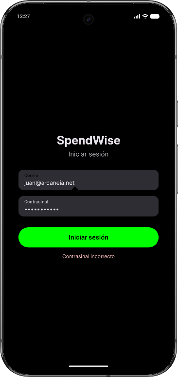  

### Acceso a aplicación
- Unha vez o login foi correcto accederemos a seguinte parte da aplicación, unha pequena pantalla de carga que nos manterá uns segundos mentras se cargan os datos da aplicación:

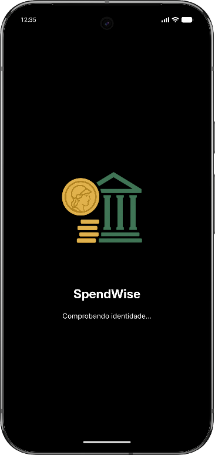  

## Menú de navegación
- A aplicación conta cun menú de navegación inferior donde podremos navegar en calquera momento dende calquera pantalla, as principais pantallas da aplicación:

  - Inicio: Pantalla principal
    - Balance de gastos/ingresos
    - Creación de gastos
    - Creación de ingresos
  - Categorías:
    - Creación de categorías para ingresos/gastos
    - Modificación de categorías
  - Historial:
    - Visualización dos movementos (ingresos, gastos, movementos recorrentes)
    - Filtrados por ano e mes con movementos
    - Edición de movementos xa creados
  - Mov. Recur:
    - Visualización dos movementos recorrentes configurados
    - Edición dos movementos recorrentes
    - Creación de novos movementos recorrentes
  - Config:
    - Posibilidade de exportar os datos da aplicación a un zip
    - Posibilidade de importar os datos da aplicación a través dun zip
    - Xestión de permisos: Permite habilitar ou deshabilitar os permisos de notificacións da aplicación  

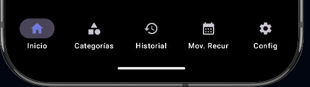  

## Pantalla principal

- A primeira pantalla que veremos será a pantalla principal, dende a que poderemos facer o seguinte:
  - Ver o balance de ingresos e gastos mensual
  - Realizar un ingreso accedendo a pantalla Ingreso
  - Realizar un gasto accedendo a pantalla Gasto

- #NOTA: A pantalla ingreso e gasto son exactamente iguais, podería farse nunha única pantalla engadindo un despregable indicando si se trata dun ingreso ou un gasto, pero faise desta maneira, de forma separada, para tratar de mellorar a usabilidade, e facendo unha interfaz máis sinxela donde persoas maiores se sintan máis cómodas.

  

### Pantalla de Gasto

- Dende a pantalla gasto poderemos crear un novo movemento de tipo gasto cubrindo o seguinte formulario:
  - Cantidade: A cantidade en euros e con decimais separados por un "." do gasto a crear
  - Categoría: A categoría a que desexamos asignar o gasto, que deberá ser previamente creada na súa correspondente pantalla
  - Descrición: Será o nome que lle asignemos ao gasto, serviranos para poder diferencialo na pantalla de historial, do resto de movementos
  - Botón GARDAR GASTO: Serviranos para validar o gasto e se está validado correctamente, crear o gasto, notificarnos do gasto creado e retornarnos a pantalla principal.

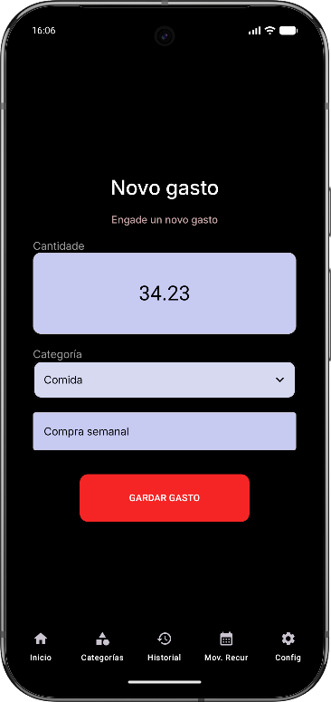  

### Pantalla de Ingreso

- Dende a pantalla ingreso podremos crear un movemento de tipo ingreso, cubrindo o seguinte formulario:
  - Cantidade: A cantidade en euros e con decimais separados por un "." do ingreso a crear
  - Categoría: A categoría a que desexamos asignar o ingreso, que deberá ser previamente creada na súa correspondente pantalla
  - Descrición: Será o nome que lle asignemos ao ingreso, serviranos para poder diferencialo na pantalla de historial, do resto de movementos
  - Botón GARDAR GASTO: Serviranos para validar o ingreso e se está validado correctamente, crear o ingreso, notificarnos do ingreso creado e retornarnos a pantalla principal.

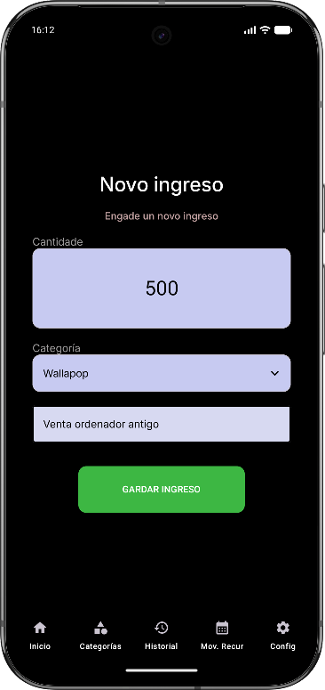  

## Pantalla de Categorías

- Pantalla destinada á creación e modificación de categorías, as cales deberán ser asignadas na creación dos movementos(ingresos, gastos)
### Creación categoría
  - Manter o despregable en "Categoría", opción por defecto
  - Cubrir o campo de texto: "Nome categoría" co nome da categoría que queiramos crear
  - Pulsar en "GARDAR CATEGORÍA". Gardarase a nova categoría e indicarase a través dunha mensaxe que se creou correctamente
### Modificación categoría
  - Seleccionar unha categoría xa creada do despregable "Categorías" donde se atopan todas as categorías dispoñibles.
  - Cubrir o campo de texto: "Nome categoría" co nome que desexamos que teña a partir de agora a categoría seleccionada.

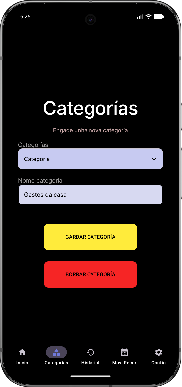  

## Pantalla de historial

- Pantalla que nos mostrará todos os movementos da nosa aplicación, tanto gastos e ingresos coma movementos recorrentes

### Visualización movementos e filtrado

- O filtrado de movementos funciona da seguinte maneira:
  - Ano: Listaranse os anos donte teñan polo menos un movemento creado
  - Mes: Listaranse os meses do ano que teñamos seleccionado e que teñan polo menos un movemento creado

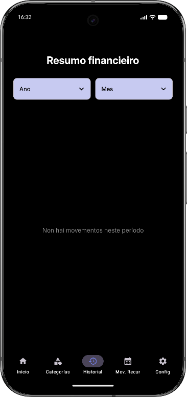  
- Os movementos ordearanse en orde de máis a menos recente mostrandose os seguintes campos:
  - Descrición do movemento
  - Data de creación do movemento
  - Categoría
  - Na parte dereita mostrarase o importe do movemento

  

### Modificación de movementos

- Premendo encima de calquera movemento podemos acceder ao seu panel de edición:
  - Modificar: Accederemos ao formulario de modificación donde poderemos modificar as propiedades do movemento
    - Nome: Permitenos modificar o nome do movemento
    - Importe (€): Permitenos modificar o importe do movemento
    - Data do movemento: Permitenos modificar a data do movemento
    - Gasto/Ingreso: Permitenos cambiar o tipo do movemento
    - Categoría: Permitenos modificar a categoría do movemento, no caso de non seleccionar ningunha manterase a que xa tiña
  - Botón "Gardar": Gardarase o movemento modificado
  - Cancelar: Desfaranse os cambios sen gardar

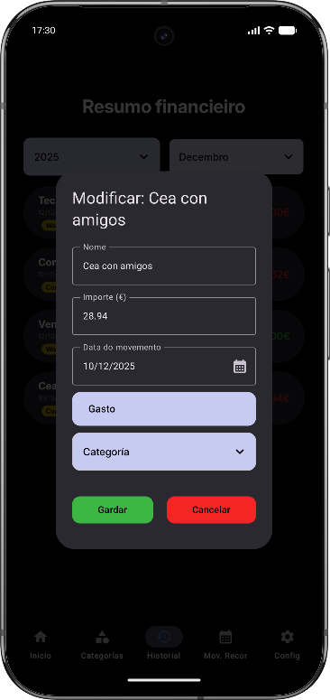  

  - Borrar: Eliminarase de forma instantánea o movemento

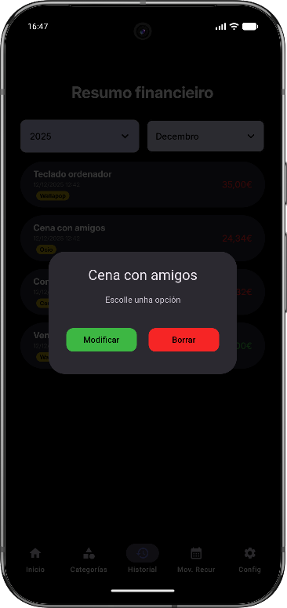  

## Pantalla de Movementos recorrentes

- Visualización de todos os movementos recorrentes que teñamos configurados, ordeados por data de próxima renovación, de forma descendente, polo que o que estea máis arriba será o máis próximo.
- Permisos: Ao acceder por primeira vez solicitaranos se queremos que se nos envíen notificacións, esto permitiranos ser notificados no momento da renovación dun gasto/ingreso recorrente

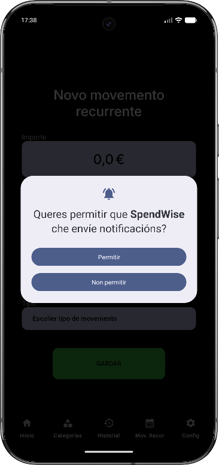  

### Visualización de movementos recorrentes

- Mostranse os seguintes datos:
  - Nome movemento recorrentes
  - Data do comezo do movemento recorrentes, a primeira data de renovación
  - Data de renovación a próxima data de renovación, cando será renovado e xerado ese movemento
  - Periodicidade do movemento: Si se renovará de forma semanal, mensual ou anual

  

### Modificación de movementos recorrentes

- Premendo encima de calquera movemento recorrente podemos acceder ao seu panel de edición:
  - Modificar: Accederemos ao formulario de modificación donde poderemos modificar as propiedades do movemento recorrente
    - Nome: O nome que terá o movemento recorrente
    - Importe (€): Importe do movemento recorrente
    - Data de comezo: Data donde comezará de novo o movemento recorrente
    - Mensual/Semanal/Anual: Periodicidade do movemento recorrente, cada canto se renovará
    - Gasto/Ingreso: Tipo do movemento recorrente, se é gasto ou ingreso

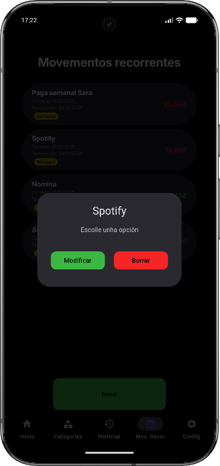  
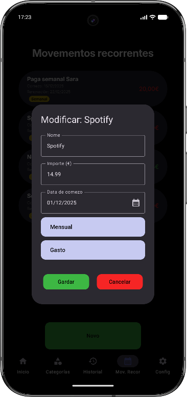  

  - Gardar: Gardarse actualizado o movemento recorrente
  - Cancelar: Desfaranse os cambios sen gardar
- Botón "Novo": Accederemos a pantalla de creación de movementos recorrentes
### Creación de movementos recorrentes

- Importe: Será o importe polo cal se cren os movementos asociados ao movemento recorrente
- Nome: O nome do movemento recorrente e dos movementos creados asociados
- Data de comezo: Data a partir da cal se calcularán os movementos que se deberán crear
- Periodicidade: Será a cantidade de días que haberá entre cada renovación
- Tipo: Tipo do movemento recorrente ingreso/gasto e dos movementos creados asociados

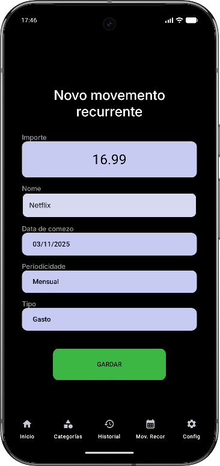  

### Funcionalidade de creación de movementos asociados

- Según a data de comezo de a periodicidade crearanse os movementos asociados que poderán ser vistos na pantalla history
- Os movementos creados serán retroactivos, si se crea un movemento recorrente de tipo mensual con data de fai 5 meses a día de hoxe, no momento que se aplique o cálculo crearanse os 5 movementos e as 5 notificacións asociadas.
- Comprobaranse as notificacións e os movementos recorrentes cada 15 minutos. Tamén se comprobarán cada vez que se inicie a aplicación.
  - Crearase a notificación
  - Calcularase a seguinte data
  - Modificarase o movemento recorrente coa nova data

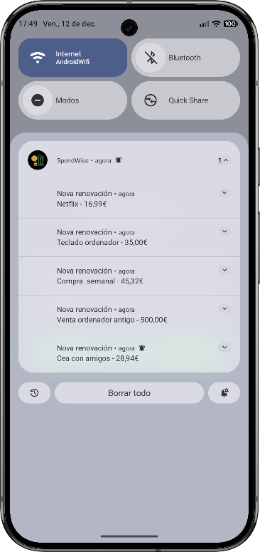  

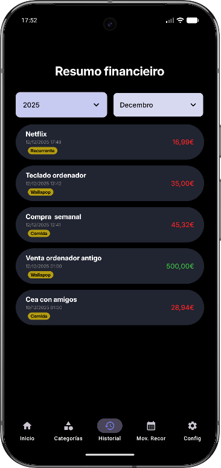  

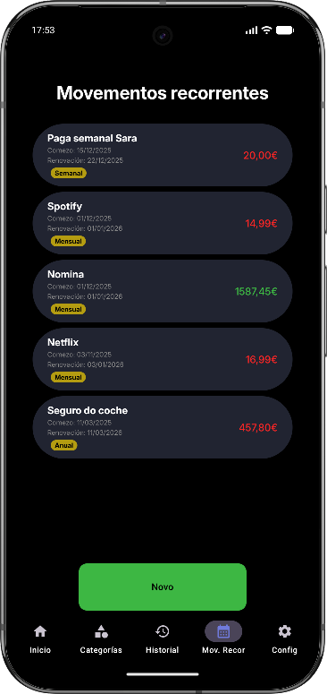  

## Pantalla Configuración

- Esta pantalla ten como finalidade facer moficiacións globais da aplicación.
- Funcionalidades:
  - Datos:
    - Exportar datos: A través dun fichero zip podremos exportar os datos da nosa aplicación
    - Importar datos: A través dun fichero zip podremos importar os datos de outra aplicación
  - Permisos:
    - Poderemos habilitar ou deshabilitar os permisos de notificacións da aplicación mediante un botón, ademáis disto mostrarse cando están habilitados ou deshabilitados, por se non estamos seguros

## NOTA
- **Durante a avaliación do proxecto estará habilitado o seguinte usuario e contrasinal para acceder a aplicación:** [credenciais](credenciais.md)