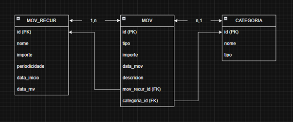
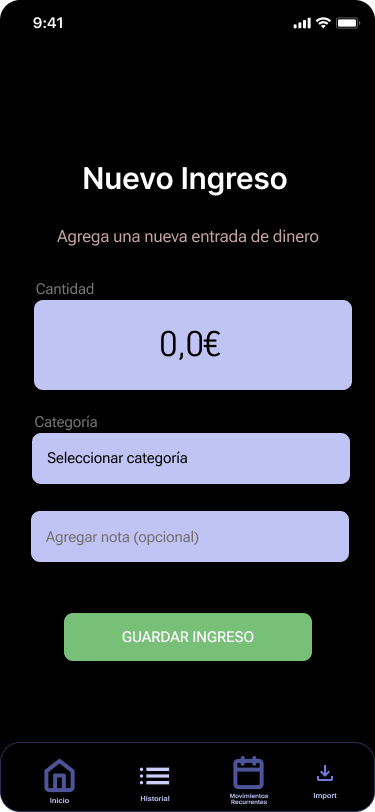
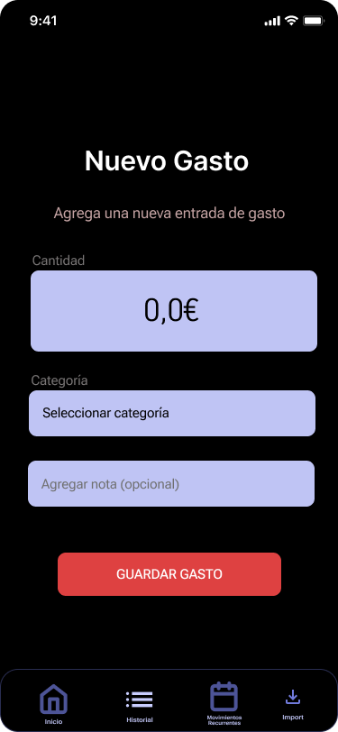
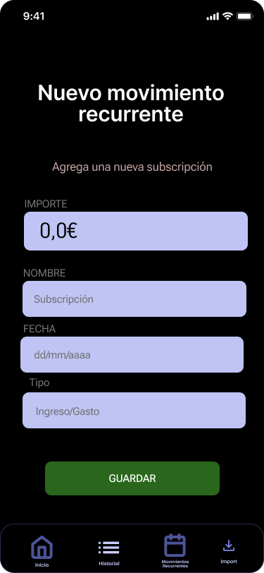
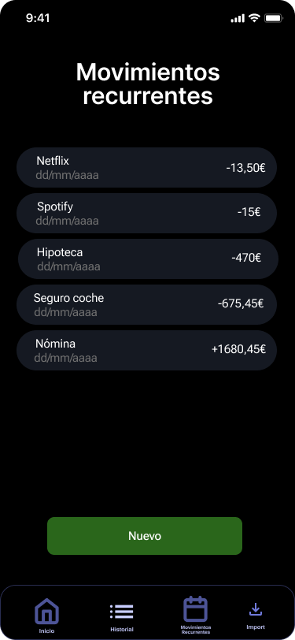
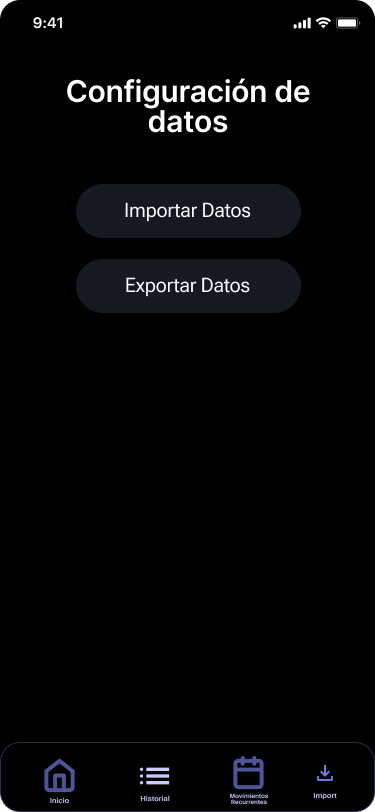
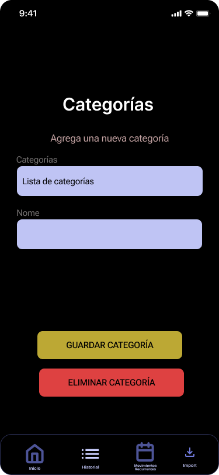
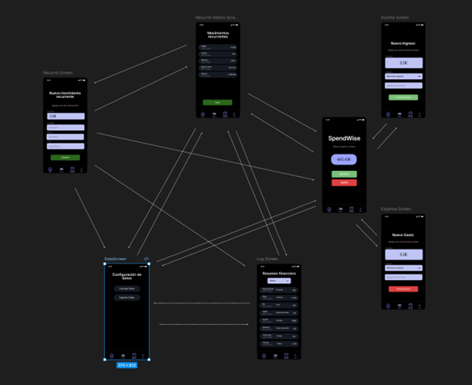

# ENTREGA FINAL

> *TODO*: Documenta de xeito detallado os resultados desenvolvidos no teu proxecto, incluindo os cambios en relación ao anteproxecto. 

> *TODO*: Inclúe, en forma de documentación, un Manual técnico e un Manual de usuario específicos para o teu proxecto. 

> #NOTA JUAN: PENDENTE CAMBIAR O DOCUMENTO A PRESENTE E ENGADIR NOVAS FUNCIONALIDADES

# ANTEPROXECTO SPENDWISE

_Juan Vázquez Bueno_

# Descrición do proxecto

O proxecto consiste nunha aplicación móbil que permita ás persoas
poder visualizar os seus gastos e ingresos dunha forma real e
estruturada. Poden ver a suma dos "gastos formiga" e que poden
aforrar dunha forma máis fácil.

1.  Xustificación do proxecto

A idea do proxecto xurdiume despois de ver como persoas que coñezo anotaban os seus gastos, por exemplo, do supermercado, cando iban a tomar algo e gastaban cartos en ocio, facían un Bizum, ou mesmo apartaban cartos para outra conta de aforro, e anotaban todo esto nun papel, ou mesmo nas notas do móbil, para despois a fin de mes poder sumar todo e ver canto destinaran a cada cousa.

Vendo todo esto xurdiume a idea de crear unha aplicación que solucionara todas estas necesidades que lle xurdían ás persoas. Poder anotar gastos, asignalos a categorías, anotar subscricións ou pagos recurrentes etc.

2.  Estudo de necesidades

Con respecto a aplicación máis utilizada para este fin sería a propia aplicación do banco, a cal na maioría dos casos xa nos fai unha pequena separación de gastos por categorías e uns resumos mensuais. Tamén
existen outras como "Money manager & expenses" ou "Money Tracker-Expense & Budget". Moitas aplicacións que limitan as funcionalidades básicas a versións "pro" ou implementan publicidade que empeora a experiencia de
usuario ou como no caso das que nos suele incluír o banco, non nos permite cambiar categorías ou incluír outras contas etc

3.  Persoas destinatarias

O público obxectivo desta aplicación son todas as persoas físicas, que poidan dispor de un móbil e teñan coñecementos básicos de como utilizalo. Xa que é unha aplicación moi intuitiva e sinxela. A idade
de uso vai dende os máis novos ata persoas maiores ou xubilados, xa que administrar o noso diñeiro é algo que dunha forma ou doutra faremos ao longo de toda a nosa vida.

4.  Modelo de negocio

O modelo de negocio é "freemium" donde a aplicación gratuíta inclúe todas as funcionalidades básicas e máis usadas. E a versión Premium será utilizada para poder desfrutar das últimas novidades antes de tempo, acceso a un histórico de movementos ilimitado e máis opcións como mostrar estatísticas e gráficos dos gastos e ingresos.

5.  Funcionalidades do proxecto (obxectivos e alcance)

A aplicación ten as seguintes funcionalidades:

- Permite visualizar o balance de ingresos e gastos.

Mostra o balance entre ingresos e gastos do mes actual

- Crear categorías.

Permite crear categorías personalidadas. Estas categorías son necesarias a hora de engadir un gasto ou ingreso. Cando engadamos un novo gasto ou ingreso deberemos asignalo a unha categoría.

- Engadir gastos e ingresos

Podemos engadir un gasto ou un ingreso a través dos seus respectivos formularios.

- Visualizar movementos

Podemos visualizar o histórico de movementos. Visualizando o día e hora do movemento, se foi ingreso ou gasto, a súa categoría así como o importe, e podemos filtrar por mes e ano, estos apareceren dispoñibles en función dos anos nos que teñámos algún movemento e dentro dese ano os meses donde teñamos movementos.

- Desprazamento a través de un menú inferior que nos permitirá movernos a través das pantallas.

Un BottomBar que nos permitirá movernos entre as distintas pantallas. Todas as pantallas permiten navegar a calquera pantalla a excepción da pantalla de ingresos e gastos, só navegable a través da pantalla principal.

 - Configuración de límite de gasto mensual por categoría.

Poderemos configurar un límite de gasto para cada categoría que
queiramos, para así que nos notifique cando nos esteamos acercando a ese
límite.

 - Engadir gastos ou ingresos recurrentes

Teremos a posibilidade de configurar gastos recurrentes que se nos farán
automáticamente, e da mesma forma poderemos configurar ingresos tamén
recurrentes, como por exemplo a nosa nómina ou ingresos por un alquiler
dunha vivenda etc.

 - Visualizar os movementos recurrentes

Pantalla donde poderemos consultar os movementos recurrentes tanto
ingresos como gastos que teñamos configurados

#### Funcionalidades adicionales

- A aplicación dispón dunha verificación biométrica de por código

Permitirá acceder a aplicación utilizando a verificación biométrica do dispositivo,
ou ben o patrón/pin de desbloqueo. Inclúese o patrón de desbloqueo como forma de autenticación
xa que a aplicación está pensada para todos os públicos, e moitas persoas maiores seguen tendo 
dispositivos antigos que carecen de desbloqueo biométrico como desbloqueo por huella ou desbloqueo facial.

- Exportado / Importado de Datos

Permite exportar os datos da BBDD para o seu posterior importado noutro dispositivo móbil. Esto permitenos migrar os datos dun dispositivo a outro.

# Recursos

-   Como relación ás necesidades económicas e de recursos necesarios para o desenvolvemento do proxecto:
    -   Dispositivo móvil necesario para probas reais: Samsung Galaxy A54 5G -> 300€
    -   Equipo de sobremesa con rendemento óptimo para desenvolvemento fluido -> 1000€
    -   Software utilizado:
        -   Android Studio (Gratuito)
        -   Drawio (Gratuito)
        -   Figma (Gratuito)   

__Orzamento:__ 1300€

O proxecto está desenvolto utilizando Android Studio, xa que é o IDE desenvolto por Google máis recomendado para crear aplicacións Android.

Como linguaxe de programación utilizouse Kotlin, que é a linguaxe que Google recomenda para a creación de aplicacións Android dende 2017.

A aplicación foi programada usando Jetpack Compose, un kit de ferramentas que Google recomenda usar dende 2021 para crear interfaces modernas e de unha forma máis fácil, rápida e sen usar XML.

A BBDD utilizada SQLite, está implementada na aplicación usando ROOM, unha librería de persistencia de datos recomendada dende 2017.
Máis segura, con menos código repetitivo. Crearase de forma local no propio dispositivo, pero creada desta forma será moi fácil migrala a plataformas como Supabase ou a un servidor de BBDD propio.

#### Funcionalidades adicionales

- Implementouse FLOW, unha librería que permite manexar datos asíncronos de forma reactiva. Esto permitenos interactuar coa BBDD de forma reactiva e permite a UI recompoñerse automáticamente. Por exemplo cando engadimos un gasto, automáticamente a pantalla do histórico será actualizada e mostrará ese gasto, e o balance de ingresos e gastos da pantalla principal será actualizado sen a necesidade de facer nada máis.

# Análise de requirimentos do sistema

1.  Funcionalidades

| **ACCIÓN**                             | **DESCRICIÓN**                                                                                                   |
|:---------------------------------------|:------------------------------------------------------------------------------------------------------------------|
| **Alta gasto**                         | Engade un novo gasto na base de datos                                                                           |
| **Alta ingreso**                       | Engade un novo ingreso na base de datos                                                                         |
| **Alta gasto/ingreso recorrente**      | Crea un novo gasto/ingreso periódico que se rexistrará automaticamente como un gasto ou ingreso segundo corresponda |
| **Consulta balance mensual**           | Amosar un resumo do balance entre ingresos e gastos                                                              |
| **Consulta historial**                 | Visualiza o rexistro de gastos e ingresos doutros meses ou anos anteriores filtrando por anos e meses con movementos dispoñibles                                     |
| **Consultar movementos recorrentes**   | Amosar a lista completa de movementos recorrentes activos e a cantidade correspondente a cada un                 |
| **Exportado de Datos**                 | Permitirá exportar os datos da BBDD                                                                              |
| **Importado de Datos**                 | Permitirá importar os datos incluíndo un ficheiro coa BBDD                                                       |
| **Creación de categorías**             | Permite crear categorías personalizadas
| **Autenticación biométrica**           | Permite acceder a aplicación autenticandose con desbloqueo biométrico ou patrón/pin de desbloqueo
| **Splash Screen**                      | Unha pantalla configurada con n deelay que nos permitirá facer os cálculos de base de datos antes de iniciar a aplicación dando sensación de fluidez

1.  Normativa

🔹 Aviso legal

A aplicación SpendWise é unha ferramenta desenvolvida con fins educativos e persoais para a xestión de gastos e ingresos.

Non recolle datos persoais identificativos (como nome, correo electrónico ou número de teléfono), xa que toda a información introducida polo usuario almacénase localmente no dispositivo mediante a base de datos SQLite/Room e non se comparte con terceiros nin se transmite a servidores externos.

O responsable do tratamento dos datos é o desenvolvedor da aplicación, quen garante que a información persoal dos usuarios se empregará unicamente co propósito de permitir o correcto funcionamento da aplicación e ofrecer as funcionalidades previstas.

🔹 Política de privacidade

Finalidade do tratamento:\
Os datos introducidos polo usuario (rexistros de gastos, ingresos e subscricións) utilízanse exclusivamente para o cálculo de balances, estatísticas e historial de transaccións dentro da propia aplicación.

Base lexítima:\
O tratamento realízase co consentimento expreso do usuario, que é quen decide introducir e conservar a información no seu dispositivo.

Dereitos do usuario:\
O usuario pode, en calquera momento:

- Modificar ou eliminar os seus rexistros financeiros.

- Desinstalar a aplicación, o que implica a eliminación total dos datos almacenados localmente.

Medidas de seguridade:

- A información almacénase unicamente na base de datos local do dispositivo (sen conexión a internet).

- Non se realiza transferencia de datos a servidores externos nin a terceiros.

- Empreganse mecanismos de seguridade do sistema operativo Android para protexer o acceso á información (seguridade biométrica).

🔹 Política de cookies

A aplicación non utiliza cookies nin tecnoloxías de seguimento web, xa que funciona de forma local e independente da rede.

# Deseño

1.  Deseño da arquitectura do sistema

A aplicación SpendWise está baseada nunha arquitectura en capas, seguindo o patrón MVVM (Model-View-ViewModel) recomendada por Android para proxectos con Jetpack Compose.

Esta estrutura permite unha separación clara e facilita o mantemento, as probas e a escalabilidade do proxecto.

Deseño:

Interface do Usuario UI: Implementada con Jetpack Compose. Contén as pantallas, compoñentes visuais e interaccións do usuario.

ViewModel: Actúa como intermediario entre a UI e os datos. Contén a lóxica e xestiona o estado da interface accedendo aos datos.

Repositorio: Encargase de proporcionar os datos á ViewModel. Xestiona o acceso á base de datos local mediante DAO de Room.

Base de datos (Room / SQLite / FLOW): Almacena de forma persistente e reactiva os rexistros de gastos, ingresos e subscricións no dispositivo. Non se emprega ningunha conexión á nube.

Modelo datos: Define a información que se gardan na base de datos e se utilizan en toda a aplicación.

2.  Deseño da persistencia de datos

3.  Deseño da interface de usuario

Main Screen: É a pantalla principal que nos mostrará o balance de ingresos/gastos e nos permite engadir ingresos ou gastos

Income Screen: Pantalla de ingresos, sirve para crear un novo ingreso

Expense Screen: Pantalla de gastos, sirve para crear un novo gasto

Log Screen: Pantalla destinada a mostrar o historial de gastos, incluídos os gastos recurrentes

Recurrin Screen: Pantalla destinada a crear os gastos recurrentes

Recurrin History: Pantalla destinada a ver os movementos recurrentes que temos configurados actualmente, tanto ingresos como gastos

Data Screen: Pantalla destinada ao importado e exportado de datos

Category Screen: Pantalla destinada a crear, editar e eliminar categorías

1. Navegación de vistas:

Disponse de un bottom menú para a navegación entre as pantallas principales.

### Problemas atopados

- Necesidade de un método de autenticación ou verificación para autenticar o usuario e que solo o usuario teña acceso. Para solucionar esto implementase unha verificación biométrica

- Necesidade de un menú de navegación. Tiña un problema que sempre tiña que pintar a BottomBar en todas as pantallas. Para solucionar esto creeina como unha screen máis e implementeina na navegación. Así podo xestionar en que pantallas quero que se visualice e en cales no. E ao xestionar a navegación de vistas a través de AppNavigation teño moito máis control das navegacións

- Necesidade actualización constante de variables como o balance de ingresos e gastos. Cando añadía os gastos gardabase na base de datos pero para actualizalos tiña que salir e volver a entrar. Para solucionar esto implementei FLOW que permite facer actualizacións automáticas cada vez que insertas ou moficas na base de datos. Unha vez añado un gasto este actualiza o balance global e tamén o history etc.

- Na pantalla de HistoryScreen donde se almacena o histórico de movementos, nun inicio tiña pensado ubicar a categoría na parte central entre o importe e a descrición pero esto provocoume moitos problemas cando a cantidade era moi grande ou a descrición moi larga, polo que decidin ubicar a categoría debaixo da data do movemento así hai máis espazo tanto para a cantidade como para a descrición.

- Con respecto ao tamaño do importe no histórico de movementos decidin que cando pase de x cifras cambie o tamaño da fonte para facelo máis pequeno así non se come toda a pantalla cando son cifras altas.
- En relación a descrición no histórico de movementos tiña o problema que cando era moi largo perdía lexibilidade e igual que a cantidade comíase moita pantalla polo que implmentei que cando pase de n caracteres meta un intro e separe en máis lineas.

- Cando creo un movemento recurrente para poder ter tanto gastos como ingresos recurrentes non teño unha maneibra de indicar que vai ser un gasto ou un ingreso.

- No movemento recurrente tiña almacenada as datas como Long, pero dificultábame moito manexalas e operar con elas, polo que as cambio a String para utilizar os métodos comúns de date

- Chamaba ao método de creación de movementos recurrentes no Main Activity, pero esto daba erros xa que cando a app estaba cerrada non se chamaban aos métodos, polo que se implementa unha clase Aplication. Forma de  facelo que recomenta Google: https://developer.android.com/topic/libraries/architecture/workmanager#schedule_from_application