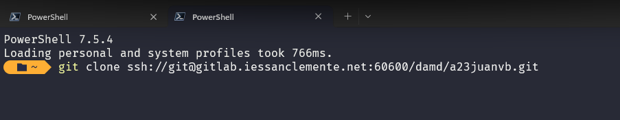

# Manual técnico SpendWise 2025

- [Manual técnico SpendWise 2025](#manual-técnico-spendwise-2025)
  - [Introdución](#introdución)
  - [Despregue PocketBase utilizando Docker](#despregue-pocketbase-utilizando-docker)
  - [Clonado repositorio](#clonado-repositorio)
  - [Estrutura do código](#estrutura-do-código)
  - [Documentación da aplicación](#documentación-da-aplicación)

## Introdución
SpendWise é unha aplicación desenvolta en Android Studio utilizando Jetpack Compose, SQLite, ROOM, FLOW e facendo un gardado de datos e login contra unha base de datos PocketBase. A continuación expoñerase como poder crear este entorno de desenvolvemento.

## Despregue PocketBase utilizando Docker
PocketBase permite ser autoaloxada nun servidor local, o seu repositorio en GitHub é o seguinte: [PocketBase](https://github.com/pocketbase/pocketbase) e tamén dispón dunha páxina web: [Web PocketBase](https://pocketbase.io/).
Esta aplicación está baseada en coleccións polo que ten múltiples usos. Dispón dunha API para os despregues de escritorio, no caso de SpendWise ao ser unha aplicación android ainda non dispón dunha API propia soportada, pero sí soporta API REST que será o método que utilicemos para crear e consultar datos.
A continuación exponse a configuración utilizada para o desenvolvemento do proxecto SpendWise:

- A base de datos pocketbase está despregada nun contenedor docker nun servidor Linux virtualizado con Proxmox.
- Ó contenedor accedese a través dun proxy configurado para bloquear o acceso a /_/ donde está a administración do servicio. Tamén fai unha redirección ao porto 8090 utilizado para a API e engade un certificado HTTPS xerado con Let's Encrypt. Tanto Nginx como PocketBase atopanse nunha rede DMZ securizada e ambos están no mesmo servidor docker compartido unha rede docker O dominio utilizado é valora.arcaneia.net, un subdominio de arcaneia.net, propiedade do autor da aplicación. A continuación mostrase a configuración usada:

  - Docker Compose PocketBase: [Doc](https://github.com/muchobien/pocketbase-docker)

```yaml
services:
  pocketbase:
    image: ghcr.io/muchobien/pocketbase:latest
    container_name: pocketbase
    restart: unless-stopped
    networks:
      - proxy_net

    environment:
      PB_HOST: 0.0.0.0
      PB_PORT: 8090
      PB_ADMIN_EMAIL: ${ADMIN_EMAIL}
      PB_ADMIN_PASSWORD: ${ADMIN_PASSWORD}
      ENCRYPTION: ${PB_ENCRYPTION_KEY}
      TZ: Europe/Madrid

    ports:
      - "8090:8090"

    volumes:
      - ./pb_data:/pb_data
      - ./pb_public:/pb_public
      - ./pb_hooks:/pb_hooks
      - ./pb_logs:/pb_data/logs

    command: ["--encryptionEnv", "ENCRYPTION"]
    healthcheck:
      test:
        [
          "CMD",
          "wget",
          "--no-verbose",
          "--tries=1",
          "--spider",
          "http://localhost:8090/api/health",
        ]
      interval: 30s
      timeout: 10s
      retries: 3
      start_period: 30s

    user: "1000:1000"

networks:
  proxy_net:
    external:
      name: nginxproxy_proxy_net
```
- (Opcional) Nginx Proxy Manager: [Doc](https://nginxproxymanager.com/setup/)
```yaml
services:
  npm:
    image: jc21/nginx-proxy-manager:latest
    container_name: nginx-proxy-manager
    restart: unless-stopped

    ports:
      - "80:80"
      - "443:443"
      - "172.16.66.10:81:81"

    networks:
      - proxy_net

    environment:
      DISABLE_IPV6: 'true'

    volumes:
      - ./data:/data
      - ./letsencrypt:/etc/letsencrypt

    deploy:
      resources:
        limits:
          cpus: "1"
          memory: 1024M

networks:
  proxy_net:
    driver: bridge
```

- Logo de ter o servicio de pocketbase despregado podemos proceder a crear as coleccións e usuarios necesarios:
<details>
  <summary>Ver código JSON</summary>

```json
[
  {
    "id": "pbc_708572341",
    "listRule": "@request.auth.id = user.id",
    "viewRule": "@request.auth.id = user.id",
    "createRule": "@request.auth.id != \"\"",
    "updateRule": "@request.auth.id = user.id",
    "deleteRule": "@request.auth.id = user.id",
    "name": "categoria",
    "type": "base",
    "fields": [
      {
        "autogeneratePattern": "[a-z0-9]{15}",
        "hidden": false,
        "id": "text3208210256",
        "max": 15,
        "min": 15,
        "name": "id",
        "pattern": "^[a-z0-9]+$",
        "presentable": false,
        "primaryKey": true,
        "required": true,
        "system": true,
        "type": "text"
      },
      {
        "autogeneratePattern": "",
        "hidden": false,
        "id": "text1421693708",
        "max": 0,
        "min": 0,
        "name": "nome",
        "pattern": "",
        "presentable": false,
        "primaryKey": false,
        "required": false,
        "system": false,
        "type": "text"
      },
      {
        "autogeneratePattern": "",
        "hidden": false,
        "id": "text1882004807",
        "max": 0,
        "min": 0,
        "name": "tipo",
        "pattern": "",
        "presentable": false,
        "primaryKey": false,
        "required": false,
        "system": false,
        "type": "text"
      },
      {
        "cascadeDelete": false,
        "collectionId": "_pb_users_auth_",
        "hidden": false,
        "id": "relation2375276105",
        "maxSelect": 1,
        "minSelect": 0,
        "name": "user",
        "presentable": false,
        "required": false,
        "system": false,
        "type": "relation"
      },
      {
        "hidden": false,
        "id": "autodate2990389176",
        "name": "created",
        "onCreate": true,
        "onUpdate": false,
        "presentable": false,
        "system": false,
        "type": "autodate"
      },
      {
        "hidden": false,
        "id": "autodate3332085495",
        "name": "updated",
        "onCreate": true,
        "onUpdate": true,
        "presentable": false,
        "system": false,
        "type": "autodate"
      }
    ],
    "indexes": [],
    "system": false
  },
  {
    "id": "pbc_3949672561",
    "listRule": "@request.auth.id = user.id",
    "viewRule": "@request.auth.id = user.id",
    "createRule": "@request.auth.id != \"\"",
    "updateRule": "@request.auth.id = user.id",
    "deleteRule": "@request.auth.id = user.id",
    "name": "mov",
    "type": "base",
    "fields": [
      {
        "autogeneratePattern": "[a-z0-9]{15}",
        "hidden": false,
        "id": "text3208210256",
        "max": 15,
        "min": 15,
        "name": "id",
        "pattern": "^[a-z0-9]+$",
        "presentable": false,
        "primaryKey": true,
        "required": true,
        "system": true,
        "type": "text"
      },
      {
        "autogeneratePattern": "",
        "hidden": false,
        "id": "text1882004807",
        "max": 0,
        "min": 0,
        "name": "tipo",
        "pattern": "",
        "presentable": false,
        "primaryKey": false,
        "required": false,
        "system": false,
        "type": "text"
      },
      {
        "hidden": false,
        "id": "number2353092685",
        "max": null,
        "min": null,
        "name": "importe",
        "onlyInt": false,
        "presentable": false,
        "required": false,
        "system": false,
        "type": "number"
      },
      {
        "autogeneratePattern": "",
        "hidden": false,
        "id": "text2697053109",
        "max": 0,
        "min": 0,
        "name": "data_mov",
        "pattern": "",
        "presentable": false,
        "primaryKey": false,
        "required": false,
        "system": false,
        "type": "text"
      },
      {
        "cascadeDelete": false,
        "collectionId": "pbc_708572341",
        "hidden": false,
        "id": "relation865562746",
        "maxSelect": 1,
        "minSelect": 0,
        "name": "categoria_id",
        "presentable": false,
        "required": false,
        "system": false,
        "type": "relation"
      },
      {
        "autogeneratePattern": "",
        "hidden": false,
        "id": "text1103225375",
        "max": 0,
        "min": 0,
        "name": "descricion",
        "pattern": "",
        "presentable": false,
        "primaryKey": false,
        "required": false,
        "system": false,
        "type": "text"
      },
      {
        "cascadeDelete": false,
        "collectionId": "_pb_users_auth_",
        "hidden": false,
        "id": "relation2375276105",
        "maxSelect": 1,
        "minSelect": 0,
        "name": "user",
        "presentable": false,
        "required": false,
        "system": false,
        "type": "relation"
      },
      {
        "cascadeDelete": false,
        "collectionId": "pbc_2107450789",
        "hidden": false,
        "id": "relation2284265950",
        "maxSelect": 1,
        "minSelect": 0,
        "name": "mov_recur_id",
        "presentable": false,
        "required": false,
        "system": false,
        "type": "relation"
      },
      {
        "autogeneratePattern": "",
        "hidden": false,
        "id": "text1203105844",
        "max": 0,
        "min": 0,
        "name": "renew_hash",
        "pattern": "",
        "presentable": false,
        "primaryKey": false,
        "required": false,
        "system": false,
        "type": "text"
      },
      {
        "hidden": false,
        "id": "autodate2990389176",
        "name": "created",
        "onCreate": true,
        "onUpdate": false,
        "presentable": false,
        "system": false,
        "type": "autodate"
      },
      {
        "hidden": false,
        "id": "autodate3332085495",
        "name": "updated",
        "onCreate": true,
        "onUpdate": true,
        "presentable": false,
        "system": false,
        "type": "autodate"
      }
    ],
    "indexes": [],
    "system": false
  },
  {
    "id": "pbc_2107450789",
    "listRule": "@request.auth.id = user.id",
    "viewRule": "@request.auth.id = user.id",
    "createRule": "@request.auth.id != \"\"",
    "updateRule": "@request.auth.id = user.id",
    "deleteRule": "@request.auth.id = user.id",
    "name": "mov_recur",
    "type": "base",
    "fields": [
      {
        "autogeneratePattern": "[a-z0-9]{15}",
        "hidden": false,
        "id": "text3208210256",
        "max": 15,
        "min": 15,
        "name": "id",
        "pattern": "^[a-z0-9]+$",
        "presentable": false,
        "primaryKey": true,
        "required": true,
        "system": true,
        "type": "text"
      },
      {
        "autogeneratePattern": "",
        "hidden": false,
        "id": "text1421693708",
        "max": 0,
        "min": 0,
        "name": "nome",
        "pattern": "",
        "presentable": false,
        "primaryKey": false,
        "required": false,
        "system": false,
        "type": "text"
      },
      {
        "hidden": false,
        "id": "number2353092685",
        "max": null,
        "min": null,
        "name": "importe",
        "onlyInt": false,
        "presentable": false,
        "required": false,
        "system": false,
        "type": "number"
      },
      {
        "autogeneratePattern": "",
        "hidden": false,
        "id": "text2630000235",
        "max": 0,
        "min": 0,
        "name": "periodicidade",
        "pattern": "",
        "presentable": false,
        "primaryKey": false,
        "required": false,
        "system": false,
        "type": "text"
      },
      {
        "autogeneratePattern": "",
        "hidden": false,
        "id": "text870012893",
        "max": 0,
        "min": 0,
        "name": "data_ini",
        "pattern": "",
        "presentable": false,
        "primaryKey": false,
        "required": false,
        "system": false,
        "type": "text"
      },
      {
        "autogeneratePattern": "",
        "hidden": false,
        "id": "text2929727161",
        "max": 0,
        "min": 0,
        "name": "data_rnv",
        "pattern": "",
        "presentable": false,
        "primaryKey": false,
        "required": false,
        "system": false,
        "type": "text"
      },
      {
        "autogeneratePattern": "",
        "hidden": false,
        "id": "text1882004807",
        "max": 0,
        "min": 0,
        "name": "tipo",
        "pattern": "",
        "presentable": false,
        "primaryKey": false,
        "required": false,
        "system": false,
        "type": "text"
      },
      {
        "cascadeDelete": false,
        "collectionId": "_pb_users_auth_",
        "hidden": false,
        "id": "relation2375276105",
        "maxSelect": 1,
        "minSelect": 0,
        "name": "user",
        "presentable": false,
        "required": false,
        "system": false,
        "type": "relation"
      },
      {
        "hidden": false,
        "id": "autodate2990389176",
        "name": "created",
        "onCreate": true,
        "onUpdate": false,
        "presentable": false,
        "system": false,
        "type": "autodate"
      },
      {
        "hidden": false,
        "id": "autodate3332085495",
        "name": "updated",
        "onCreate": true,
        "onUpdate": true,
        "presentable": false,
        "system": false,
        "type": "autodate"
      }
    ],
    "indexes": [],
    "system": false
  }
]
```
</details>

- Logo de crear as coleccións deberemos engadir un usuario para poder facer o login dende a aplicación:
  - Prememos arriba a dereita en: **New record** 
  - E despois so deberemos cubrir os datos e marcar en verified para indicar que está habilitado 

## Clonado repositorio

- Ahora xa podermos clonar o repositorio e lanzar a aplicación
  - Debemos dispor dunha conta no GitLab do IES San Clemente
  - Clonar o repositorio: Teremos que ter previamente descargado e instalado [Git](https://git-scm.com/install/windows)
  - Para clonar o repositorio so teremos que navegar ata a URL do proxecto, facer click en **Clone with SSH** 
  - Unha vez teñamos o link iremos a nosa terminal do dispositivo e lanzaremos a descarga: 

- Por último só teremos que instalar [Android Studio](https://developer.android.com/codelabs/basic-android-kotlin-compose-install-android-studio?hl=es-419#2) o IDE máis utilizado para desenvolver proxectos Android
- Agora so nos queda abrir o proxecto previamente descargado, usando Android Studio e comezar a programar.
  - #NOTA: Android Studio tamén dispón de ferramentas para traballar directamente con git, e GitLab: 
    - Podermos descargar o repositorio directamente dende Android Studio ou enlazalo a GitLab utilizando un token.

## Estrutura do código

```
└── 📁spendwise
    └── 📁apis
        └── 📁data
            └── 📁model
                ├── CategoriaRemoteDataSource.kt
                ├── CategoriaSyncRepository.kt
                ├── CategoryDTO.kt
                ├── MovDTO.kt
                ├── MovRecurDTO.kt
                ├── MovRecurRemoteDataSource.kt
                ├── MovRecurSyncRepository.kt
                ├── MovRemoteDataSource.kt
                ├── MovSyncRepository.kt
        ├── PocketBaseApi.kt
        ├── RetrofitClient.kt
    └── 📁components
        ├── Dialog.kt
        ├── Spinners.kt
    └── 📁data
        └── 📁backup
            ├── BackupManager.kt
        └── 📁dao
            ├── CategoriaDao.kt
            ├── MovDao.kt
            ├── MovRecurDao.kt
        └── 📁database
            ├── AppDatabase.kt
            ├── Converters.kt
            ├── DatabaseCallBack.kt
        └── 📁datastore
            ├── PermissionsDataStore.kt
            ├── TokenDataStore.kt
        └── 📁di
            ├── ServiceLocator.kt
        └── 📁entity
            ├── Categoria.kt
            ├── Mov.kt
            ├── MovRecur.kt
            ├── MovWithCategory.kt
        └── 📁model
            ├── AuthModels.kt
            ├── AuthViewModel.kt
            ├── CategoriaViewModel.kt
            ├── LoginViewModel.kt
            ├── MovRecurViewModel.kt
            ├── MovViewModel.kt
            ├── Recurrence.kt
            ├── TypeMov.kt
        └── 📁repository
            ├── CategoriaRepository.kt
            ├── MovRecurRepository.kt
            ├── MovRepository.kt
        └── 📁workers
            ├── RenewMovsRecurWorker.kt
            ├── SyncWorker.kt
    └── 📁navigation
        ├── AppNavigation.kt
        ├── AppScreens.kt
    └── 📁permission
        ├── PermissionManager.kt
    └── 📁screens
        ├── CategoryScreen.kt
        ├── ExpenseScreen.kt
        ├── HistoryScreen.kt
        ├── IncomeScreen.kt
        ├── LoginScreen.kt
        ├── MainScreen.kt
        ├── MovRecurHistoryScreen.kt
        ├── NewMovRecurScreen.kt
        ├── SettingScreen.kt
        ├── SpendWiseBottomBar.kt
        ├── SplashScreen.kt
    └── 📁ui
        └── 📁theme
            ├── Color.kt
            ├── Theme.kt
            ├── Type.kt
    └── 📁utils
        ├── DateTools.kt
        ├── UtilsDataAccess.kt
    ├── MainActivity.kt
    └── SpendWiseApp.kt
```

## Documentación da aplicación

- A documentación da aplicación SpendWise está desenvolta co formato KDOC e xerada usando unha API de Android Studio chamada Dokka, a continuación deixo dous enlaces, un a versión HTML e outro a versión en Markdown
  - [HTML](manual_tecnico/html/)
  - [Markdown](manual_tecnico/markdown/)